# EMOdProdInfo 頁面 Lookup 功能說明

## 📋 功能概述

已成功為 `http://localhost:5290/EMOdProdInfo/Detail` 頁面加上**自動 Lookup 功能**，能夠：

✅ **自動從 SQL 辭典讀取 Lookup 配置**
✅ **支援雙層 Lookup（一般 Lookup + OCX Lookup）**
✅ **套用在所有表格頁籤（約 20+ 張關聯表）**
✅ **自動快取，避免重複 API 請求**
✅ **支援頂部基本資訊欄位的 Lookup**
✅ **自動格式化日期與數字**

---

## 🎯 支援的頁籤

此功能已套用在以下所有表格頁籤：

### 規格頁籤（Header）
- 料號、版次、客戶料號等基本資訊
- 支援 Lookup 轉換（如：製程碼 → 製程名稱）

### 表單頁籤（Detail）
1. **壓合明細/替代料** (`EMOdLayerPress`)
2. **板材尺寸明細圖** (`EMOdProdPOP`)
3. **裁板/排版圖** (`EMOdProdMills`)
4. **混裝明細檔** (`EMOdProdMixedDtl`)
5. **暫停記錄** (`EMOdProdLog`)
6. **修改記錄** (`EMOdNotesLog`)
7. **ECN記錄** (`EMOdProdECNLog`)
8. **併板明細檔** (`EMOdPartMerge`)
9. **壓合方式** (`EMOdProdTier`)
10. **途程內容** (`EMOdLayerRoute`)
11. **層別資料** (`EMOdProdLayer`)

---

## 🔧 Lookup 類型

### 1️⃣ 一般 Lookup（實體欄位）

**用途**：將資料表中的代碼欄位轉換為名稱顯示

**辭典配置欄位**：
- `LookupTable`：對照表名稱
- `LookupKeyField`：對照表的鍵值欄位
- `LookupResultField`：要顯示的結果欄位

**範例**：
```sql
-- 將 ProcessCode（製程碼）轉換為製程名稱
UPDATE CURdTableField
SET LookupTable = 'CURmProcess',
    LookupKeyField = 'ProcessCode',
    LookupResultField = 'ProcessName'
WHERE TableName = 'EMOdProdInfo'
  AND FieldName = 'ProcessCode';
```

**效果**：
- 顯示前：`A01`
- 顯示後：`銑削加工`

---

### 2️⃣ OCX Lookup（虛擬欄位）

**用途**：顯示資料表中沒有的虛擬欄位（關聯顯示）

**辭典配置欄位**：
- `OCXLKTableName`：對照表名稱
- `KeyFieldName`：對照表的鍵值欄位
- `KeySelfName`：主表中的實際欄位（用來取值）
- `OCXLKResultName`：要顯示的結果欄位

**範例**：
```sql
-- 顯示客戶名稱（虛擬欄位）
INSERT INTO CURdTableField (
    TableName, FieldName, DisplayLabel,
    SerialNum, Visible, ReadOnly,
    OCXLKTableName, KeyFieldName, KeySelfName, OCXLKResultName
)
VALUES (
    'EMOdProdInfo',       -- 主表
    'CustomerName',       -- 虛擬欄位名稱
    '客戶名稱',
    15, 1, 1,
    'CURmCust',           -- 對照表
    'CustNo',             -- 對照表鍵值
    'CustomerSname',      -- 主表的實際欄位（客戶代碼）
    'CustName'            -- 顯示欄位（客戶名稱）
);
```

**效果**：
- `CustomerSname` 欄位值：`C001`
- 顯示 `CustomerName`：`台灣科技公司`

---

## 🚀 使用方式

### 步驟 1：配置辭典

執行 SQL 設定 Lookup：

```sql
-- 方式 A：使用提供的範例檔案
-- 打開：EMOdProdInfo_Lookup_Setup.sql
-- 選擇需要的範例執行

-- 方式 B：手動配置
UPDATE CURdTableField
SET LookupTable = 'YourTable',
    LookupKeyField = 'KeyField',
    LookupResultField = 'DisplayField'
WHERE TableName = 'EMOdProdInfo'
  AND FieldName = 'YourField';
```

### 步驟 2：重新整理頁面

不需要修改任何程式碼，只需：
1. 重新整理瀏覽器頁面（`F5` 或 `Ctrl+R`）
2. Lookup 功能會自動生效

### 步驟 3：檢查結果

打開瀏覽器開發者工具（`F12`）→ `Console` 頁籤：

```
[layerpress] 開始載入 Lookup 資料...
[layerpress] MaterialCode: 一般 Lookup 已載入 (150 筆)
[layerpress] Supplier: 一般 Lookup 已載入 (80 筆)
[layerpress] 表格建立完成，共 25 筆資料
```

---

## 📊 Lookup API

### API 端點

```http
GET /api/TableFieldLayout/LookupData
    ?table={對照表名稱}
    &key={鍵值欄位}
    &result={結果欄位}
```

### 範例請求

```http
GET /api/TableFieldLayout/LookupData
    ?table=CURmCust
    &key=CustNo
    &result=CustName
```

### 回傳格式

```json
[
  { "key": "C001", "result0": "客戶A" },
  { "key": "C002", "result0": "客戶B" },
  { "key": "C003", "result0": "客戶C" }
]
```

### 多欄位結果

```http
GET /api/TableFieldLayout/LookupData
    ?table=CURmPart
    &key=PartNum
    &result=PartName,PartSpec
```

回傳：
```json
[
  { "key": "P001", "result0": "產品A", "result1": "規格A" }
]
```

---

## 🎨 前端實作

### 核心函數

#### 1. `loadLookup(field)` - 載入一般 Lookup
```javascript
async function loadLookup(field) {
  if (!field.LookupTable || !field.LookupKeyField || !field.LookupResultField) {
    return null;
  }

  const key = `${field.LookupTable}|${field.LookupKeyField}|${field.LookupResultField}`;
  if (LOOKUP_CACHE[key]) return LOOKUP_CACHE[key];

  const url = `/api/TableFieldLayout/LookupData`
    + `?table=${encodeURIComponent(field.LookupTable)}`
    + `&key=${encodeURIComponent(field.LookupKeyField)}`
    + `&result=${encodeURIComponent(field.LookupResultField)}`;

  const rows = await fetch(url).then(r => r.json());
  const map = {};
  rows.forEach(r => { map[r.key] = r.result0; });

  LOOKUP_CACHE[key] = map;
  return map;
}
```

#### 2. `loadOCXLookup(field)` - 載入 OCX Lookup
```javascript
async function loadOCXLookup(field) {
  if (!field.OCXLKTableName || !field.KeyFieldName || !field.OCXLKResultName) {
    return null;
  }

  const key = `${field.OCXLKTableName}|${field.KeyFieldName}|${field.OCXLKResultName}`;
  if (OCX_CACHE[key]) return OCX_CACHE[key];

  const url = `/api/TableFieldLayout/LookupData`
    + `?table=${encodeURIComponent(field.OCXLKTableName)}`
    + `&key=${encodeURIComponent(field.KeyFieldName)}`
    + `&result=${encodeURIComponent(field.OCXLKResultName)}`;

  const rows = await fetch(url).then(r => r.json());
  const map = {};
  rows.forEach(r => { map[r.key] = r.result0; });

  OCX_CACHE[key] = map;
  return map;
}
```

#### 3. `buildTable(tabKey, dict, rows)` - 建立表格（含 Lookup）
```javascript
async function buildTable(tabKey, dict, rows) {
  // ... 省略其他程式碼 ...

  // 載入所有欄位的 Lookup Maps
  const lookupMaps = {};
  const ocxMaps = {};

  for (const field of visibleFields) {
    lookupMaps[field.FieldName] = await loadLookup(field);
    ocxMaps[field.FieldName] = await loadOCXLookup(field);
  }

  // 渲染表格（套用 Lookup）
  tbody.innerHTML = rows.map(row => {
    const cells = visibleFields.map(f => {
      let rawValue = row[f.FieldName] ?? '';
      let displayValue = rawValue;

      // 優先使用 OCX Lookup
      if (ocxMaps[f.FieldName] && rawValue) {
        displayValue = ocxMaps[f.FieldName][rawValue] ?? rawValue;
      }
      // 其次使用一般 Lookup
      else if (lookupMaps[f.FieldName] && rawValue) {
        displayValue = lookupMaps[f.FieldName][rawValue] ?? rawValue;
      }

      return `<td>${displayValue}</td>`;
    }).join('');
    return `<tr>${cells}</tr>`;
  }).join('');
}
```

---

## 🔍 除錯與測試

### 1. 查看辭典配置

```sql
-- 查看一般 Lookup
SELECT
    TableName, FieldName, DisplayLabel,
    LookupTable, LookupKeyField, LookupResultField
FROM CURdTableField
WHERE TableName = 'EMOdProdInfo'
  AND LookupTable IS NOT NULL;

-- 查看 OCX Lookup
SELECT
    TableName, FieldName, DisplayLabel,
    OCXLKTableName, KeyFieldName, KeySelfName, OCXLKResultName
FROM CURdTableField
WHERE TableName = 'EMOdProdInfo'
  AND OCXLKTableName IS NOT NULL;
```

### 2. 測試 Lookup API

在瀏覽器中直接訪問：
```
http://localhost:5290/api/TableFieldLayout/LookupData?table=CURmCust&key=CustNo&result=CustName
```

### 3. 查看前端 Log

打開 Console（`F12`）查看：
```
[layerpress] 開始載入 Lookup 資料...
[layerpress] MaterialCode: 一般 Lookup 已載入 (150 筆)
[layerpress] 表格建立完成，共 25 筆資料
```

---

## ⚙️ 進階功能

### 快取機制

- **全域快取**：`LOOKUP_CACHE` 和 `OCX_CACHE`
- **快取鍵值**：`${table}|${key}|${result}`
- **快取時效**：頁面重新整理後清空
- **避免重複請求**：相同配置只會載入一次

### 優先順序

1. **OCX Lookup**（優先）
2. **一般 Lookup**（次之）
3. **原始值**（無 Lookup 時）

### 格式化

- **日期欄位**：自動格式化為 `yyyy/MM/dd`
- **數字欄位**：自動加上千分位逗號
- **其他欄位**：顯示原始字串

---

## 📝 常見問題

### Q1：為什麼 Lookup 沒有生效？

**檢查清單**：
1. 確認辭典配置正確（執行查詢 SQL）
2. 確認對照表存在且有資料
3. 確認 API 回傳正常（直接訪問 API URL）
4. 打開 Console 查看是否有錯誤訊息
5. 確認已重新整理頁面（`F5`）

### Q2：如何配置多個欄位的 Lookup？

批次設定：
```sql
UPDATE CURdTableField
SET LookupTable = 'CURmUser',
    LookupKeyField = 'UserId',
    LookupResultField = 'UserName'
WHERE FieldName = 'UserId'
  AND TableName LIKE 'EMOd%';
```

### Q3：虛擬欄位如何顯示？

需要在辭典中新增欄位記錄，並設定 `OCXLKTableName` 等欄位。

參考：`EMOdProdInfo_Lookup_Setup.sql` 範例 2

### Q4：如何查看快取狀態？

在 Console 中執行：
```javascript
console.log('一般 Lookup 快取:', LOOKUP_CACHE);
console.log('OCX Lookup 快取:', OCX_CACHE);
```

---

## 📦 檔案清單

| 檔案 | 說明 |
|------|------|
| `Detail.cshtml` | 主頁面（已加上 Lookup 功能） |
| `Detail.cshtml.cs` | 後端程式碼（無需修改） |
| `EMOdProdInfo_Lookup_Setup.sql` | Lookup 配置範例 SQL |
| `EMOdProdInfo_Lookup_README.md` | 本說明文件 |

---

## ✅ 總結

### 功能特色

1. ✅ **零程式碼**：只需配置 SQL 辭典即可
2. ✅ **自動套用**：所有表格頁籤自動支援
3. ✅ **雙層支援**：一般 Lookup + OCX Lookup
4. ✅ **快取機制**：避免重複 API 請求
5. ✅ **格式化**：自動處理日期與數字
6. ✅ **易除錯**：Console 顯示詳細 Log

### 使用流程

```mermaid
graph LR
    A[配置 SQL 辭典] --> B[重新整理頁面]
    B --> C[自動載入 Lookup]
    C --> D[顯示轉換後的資料]
```



### 適用範圍

- ✅ 所有 EMOdProdInfo 相關表格
- ✅ 約 20+ 張關聯表
- ✅ 頂部基本資訊欄位
- ✅ 所有表單頁籤

---

## 🚀 下一步

1. 根據實際需求配置各欄位的 Lookup
2. 測試各頁籤的 Lookup 是否正確顯示
3. 如有缺漏資料，檢查對照表是否完整

**參考檔案**：`EMOdProdInfo_Lookup_Setup.sql`
